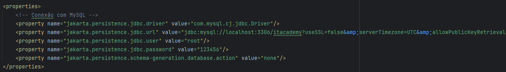

# Dell-IT-Academy-22

Configuração do Ambiente

- Java SDK 21
- Hibernate
- JPA
- Container Docker com banco de dados MySQL

## Inicialização do Projeto

Para o programa funcionar corretamente, o banco de dados deve estar ativo.
Criar database "itacademy" ou importar os bancos de exemplo contidos no projeto.

No arquivo persistence.xml estão as configurações que o JPA + Hibernate utilizarão para conectar ao banco de dados e persistir as entidades

Caso seja utilizado um container Docker para o banco de dados, o mesmo deve estar com a configuração de rede como "host" para que a aplicação encontre localmente o banco de dados

